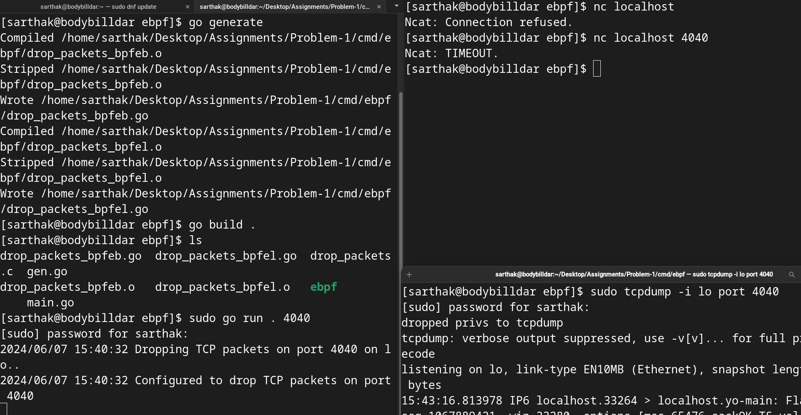

# eBPF TCP Packet Dropper

## Overview

This project demonstrates the development and deployment of an eBPF (extended Berkeley Packet Filter) program to selectively drop TCP packets targeting a specific port. The eBPF program is loaded into the Linux kernel and configured to intercept and drop TCP packets based on user-defined criteria. This can be useful for implementing network filtering and security mechanisms.

## How It Works

The project consists of a main Go program and an eBPF program written in C. Here's how it works conceptually:

1. **eBPF Program (drop_packets.c)**:
   - Written in C, the eBPF program defines a function (`xdp_prog`) that acts as the entry point for processing incoming packets.
   - The `xdp_prog` function examines each incoming packet and decides whether to drop it or allow it to pass based on certain criteria.
   - In this project, the eBPF program is configured to drop TCP packets targeting a specific port.

2. **Go Program (main.go)**:
   - The main Go program is responsible for loading the compiled eBPF program into the kernel and configuring it to run on the desired network interface.
   - It uses native Go libraries as well as external packages like `github.com/cilium/ebpf` and `github.com/vishvananda/netlink` to interact with the kernel and manage eBPF programs.

3. **Running the Program**:
   - The Go program is run with the desired port number as a command-line argument.
   - It loads the compiled eBPF program into the kernel and attaches it to the specified network interface.
   - Once attached, the eBPF program starts filtering incoming packets based on its logic.

## How to Run

Follow these steps to run the project:

1. **Prerequisites**:
   - Ensure you have Go installed on your system.
   - Make sure you have the necessary development tools to compile C programs.

2. **Compile the eBPF Program**:
   - Compile the `drop_packets.c` file into an object file (e.g., `drop_packets.o`).

3. **Run the Go Program**:
   - Run the main Go program (`main.go`) with the desired port number as a command-line argument. For example:
     ```sh
     sudo go run . 4040
     ```

4. **Testing**:
   - Monitor network traffic on the specified port using tools like `tcpdump`.
   - Attempt to connect to the specified port using `netcat` (`nc`) or other TCP clients.
   - If the eBPF program is working correctly, you should observe that TCP packets targeting the specified port are dropped.

## Commands Explanation

- `sudo go run . {port}`: This command runs the main Go program with elevated privileges (sudo) and passes the desired port number as a command-line argument. It loads the eBPF program into the kernel and configures it to drop TCP packets targeting the specified port.
  
- `sudo tcpdump -i $INTERFACE_NAME$ port {port}`: This command uses tcpdump to monitor network traffic on the specified port. Replace `$INTERFACE_NAME$` with the name of your network interface (e.g., `lo` for loopback interface).

- `nc localhost {port}`: This command attempts to establish a TCP connection to the specified port on the localhost (127.0.0.1) using netcat (nc). It is used to test the behavior of the eBPF program by attempting to connect to the port and observing whether the connection is successful.

