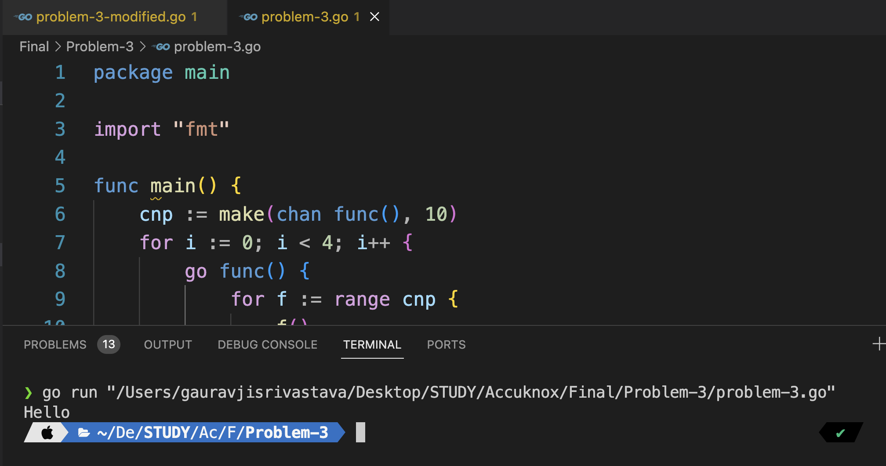
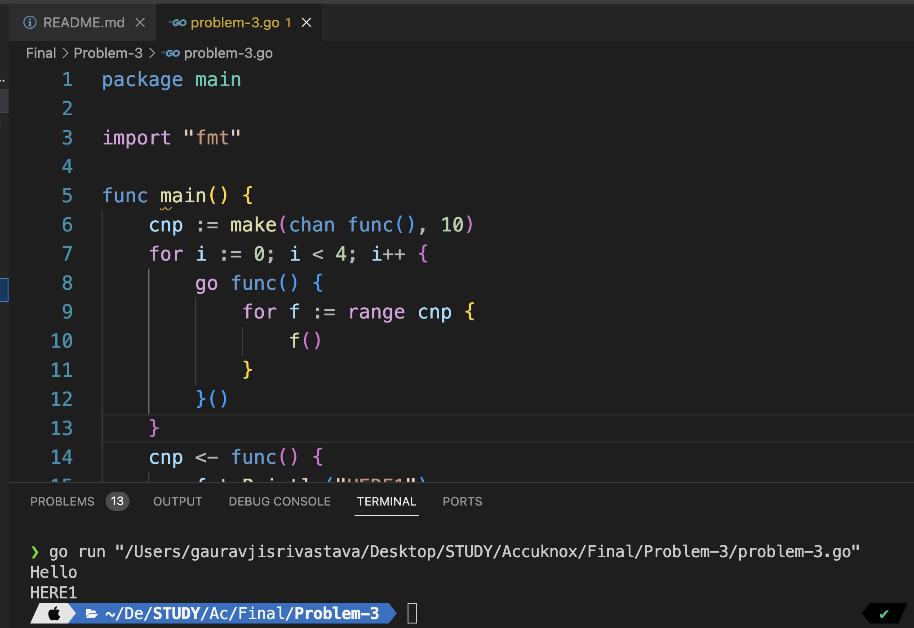
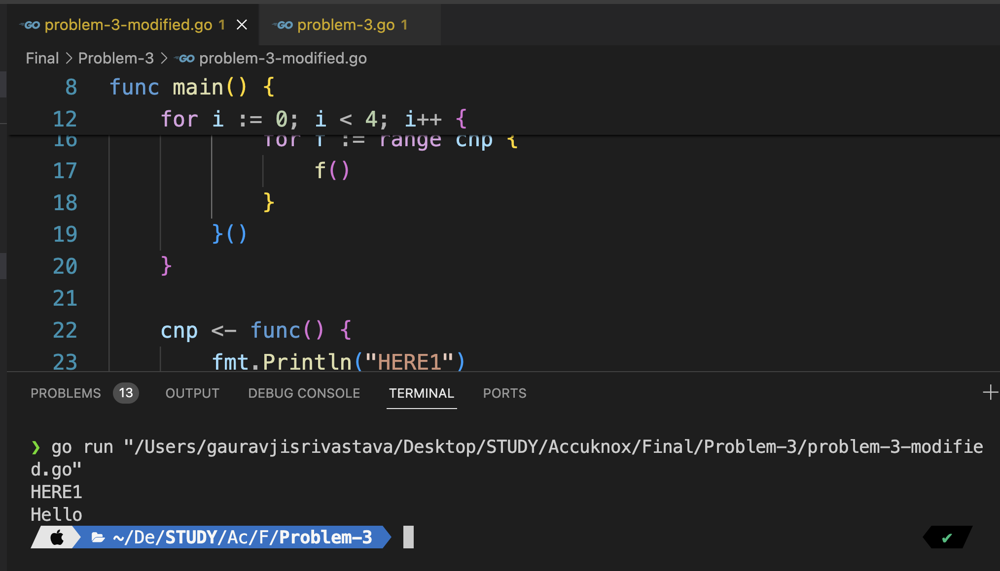

# This README answers the five questions of problem third.
# 1. Explanation of Code Constructs

1. **Buffered Channel Setup**: 
   - `cnp := make(chan func(), 10)`: Creates a buffered channel named `cnp` capable of holding 10 functions.
   
2. **Goroutines**:
   - `go func() { ... }()`: Starts a new goroutine that waits to receive and execute functions from the channel `cnp`.
   
3. **Function Sending to Channel**:
   - `cnp <- func() { fmt.Println("HERE1") }`: Sends a function to the channel `cnp` that prints "HERE1".
   
4. **Main Function Print**:
   - `fmt.Println("Hello")`: Prints "Hello" from the main function.

# 2. Use-Cases of Constructs

1. **Buffered Channels**: 
   - Use in scenarios where you want to limit the number of pending tasks. For instance, in a job scheduling system where you want to control the number of pending tasks awaiting execution.
   
2. **Goroutines**:
   - Useful for concurrent execution of tasks. For example, in a web server, you can use goroutines to handle multiple client requests concurrently, improving system responsiveness.
   
3. **Function Sending to Channel**:
   - Used for asynchronous task execution. In a task processing system, functions representing tasks can be sent to a channel, allowing workers to execute them concurrently.
   
4. **Main Function Print**:
   - Used for general program output or status updates. For instance, in a command-line tool, you might print status messages to indicate the progress of an operation.
   Example Scenario: Consider a file processing command-line tool that performs various operations on files, such as copying, moving, or deleting. In this scenario, the main function might print status messages to inform the user about the progress of each file operation.

# 3. Significance of For Loop

- The for loop with 4 iterations (`for i := 0; i < 4; i++`) starts 4 goroutines.
- This allows for concurrent execution of tasks. Each goroutine operates independently, processing tasks from the channel concurrently.
- For example, in a file processing system, you might use multiple goroutines to process different sections of a large file concurrently, improving processing speed.

# 4. Significance of Buffered Channel

- `make(chan func(), 10)`: Initializes a buffered channel with a capacity of 10.
- This allows the channel to hold up to 10 functions at a time.
- In a scenario such as a job queue, this can help limit the number of pending tasks, preventing resource exhaustion and allowing for efficient task management.

# 5. Reason for "HERE1" Not Getting Printed

- The main function sends the function that prints "HERE1" to the channel but doesn't wait for the goroutines to execute it.
- As a result, the main function proceeds to print "Hello" and then exits.
- Since the goroutines don't have enough time to execute the function from the channel before the program exits, "HERE1" is not printed consistently. However, due to the concurrent nature of goroutines, it may occasionally get printed before the program exits, as shown in the image below:





# Problem 3: Modified Solution

This modified solution ensures consistent execution of tasks before program termination. It addresses the issue observed in the original solution by adding proper synchronization using `sync.WaitGroup` and closing the channel after sending all tasks.

## Changes Made

- Added `sync.WaitGroup` synchronization.
- Closed the channel after task submission.

## Usage

To run the modified solution, execute the main function in the provided Go file:

```bash
go run problem3_modified.go
```


